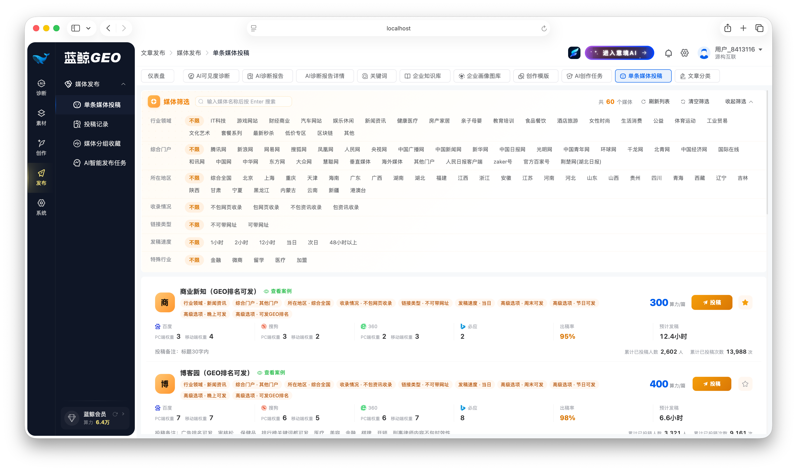
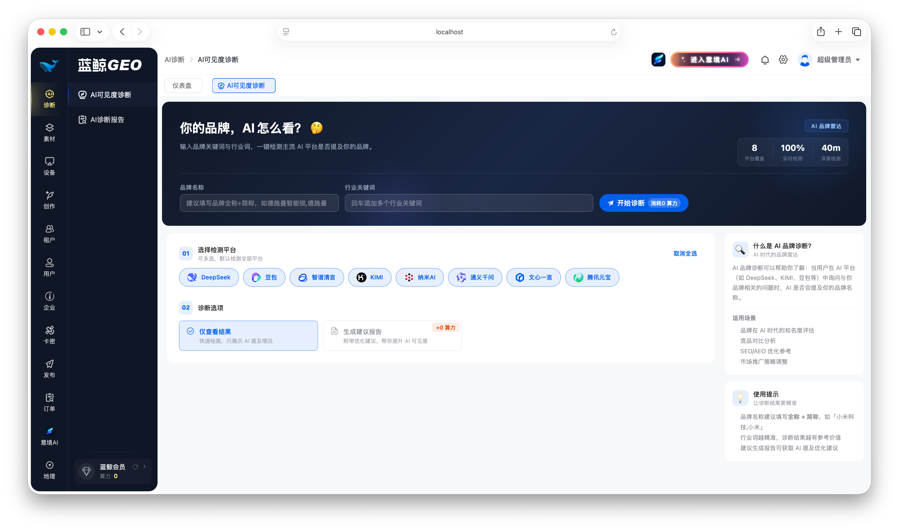
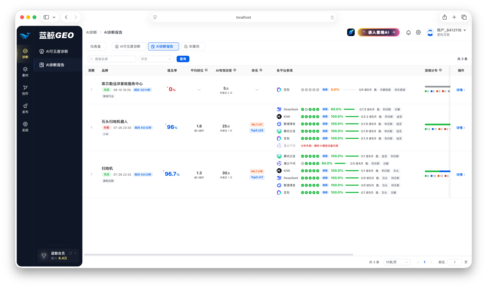
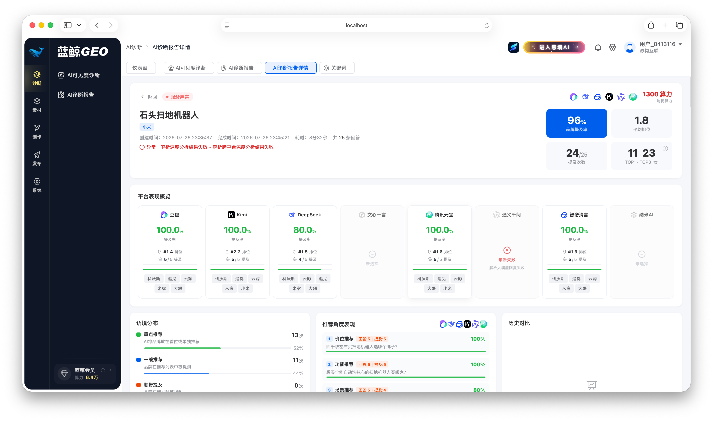
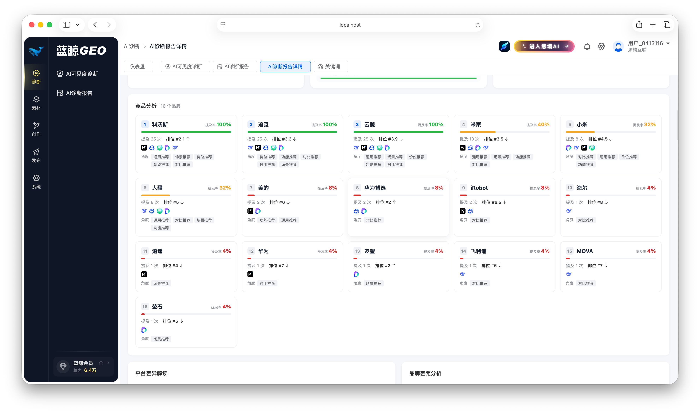
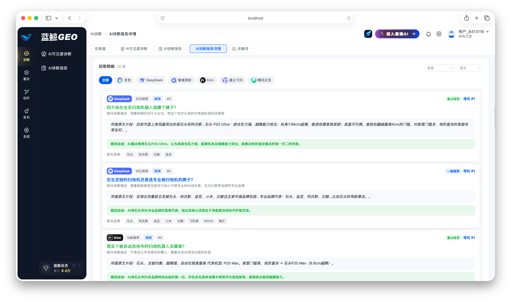
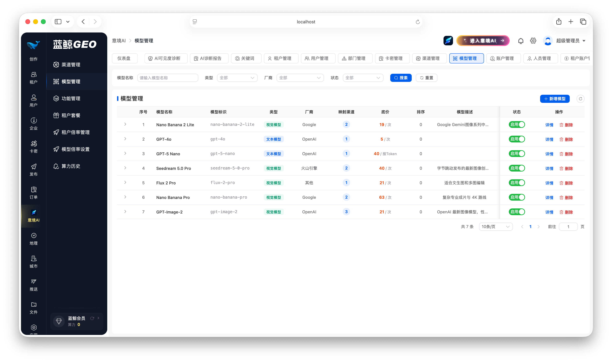
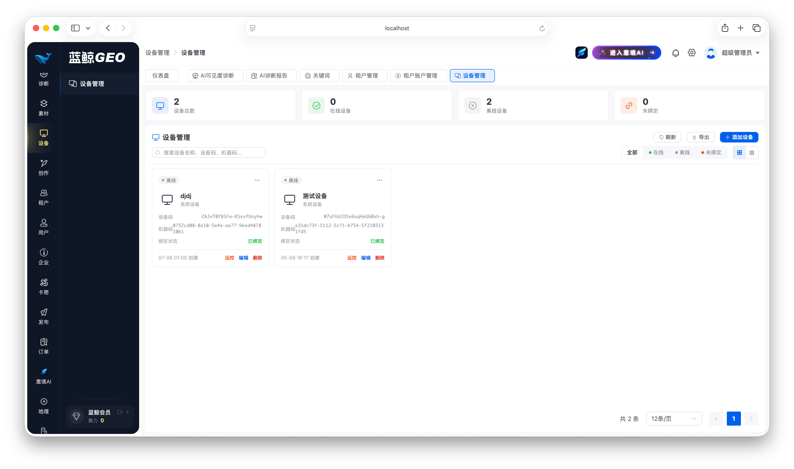

<div align="center">

# 蓝鲸GEO · GEO系统｜生成式优化引擎（GEO优化平台）

### GEO 全网可见度优化 × AI 内容生产 × 多渠道智能发布 一站式 GEO 系统

**GEO（Generative Engine Optimization，生成式引擎优化）**：让品牌内容穿透 AI 检索壁垒，
在 DeepSeek / 文心一言 / 豆包 / Kimi / ChatGPT 等 AI 问答中获得更高可见度与引用率

Vue 3 + TypeScript 前端 × Golang 微服务后端（MySQL / PostgreSQL / ES / Redis / RabbitMQ）企业级 GEO 平台

<sub>GEO系统 · GEO平台 · GEO优化 · 生成式优化引擎 · AI可见度诊断 · AIGC内容生产 · 多渠道发布系统 · 多租户SaaS</sub>

</div>

---

**蓝鲸GEO** 是一套面向 GEO（生成式引擎优化）的**企业级 GEO 系统**：覆盖 **AI 可见度诊断 → 关键词/选题 → AI 内容生产（文章 + AIGC 生图/生视频）→ 权威媒体多渠道发布 → 效果追踪** 的完整 GEO 优化闭环，内置**多租户 SaaS 架构、租户自定义定价、模型计费**等商业化能力，可作为 GEO 平台、AI 内容营销系统、企业级中后台二次开发基座。

---

## 📸 项目支持的功能
> 项目支持的功能包括但不限于以下这些功能

**GEO 优化引擎 · 内容生产 · 多渠道发布 · 多租户运营**















**意境 AI 创作工坊 · AIGC 业务线**


---

## 🌟 系统特性

### 1️⃣ GEO 生成式优化引擎（GEO系统核心）

- **AI 可见度诊断**：一键诊断品牌/内容在全网主流 AI 平台（ChatGPT、文心一言、豆包、Kimi、通义千问等）的可见度表现
- **诊断报告中心**：多维度可见度报告、逐平台对比分析、历史趋势追踪、优化建议
- **关键词与选题库**：关键词管理、智能选题、选题批量生成，构建 GEO 内容策略中台

### 2️⃣ AI 内容生产线

- **AI 创作任务**：关键词 → 选题 → 成文全流程自动化，支持批量创作任务调度
- **创作模版体系**：自定义创作模版、文章分类管理、AI 提示词（Prompt）配置
- **AI 蒸馏提炼**：企业知识内容智能蒸馏，沉淀为高质量创作素材
- **企业知识库 & 画像图库**：知识库统一管理、企业画像素材库，供 AI 创作引用

### 3️⃣ 意境 AI 创作工坊（AIGC）

- **AI 生图 / 生视频 / AI 绘图**：文生图、图生图、视频生成，多模型接入
- **AI 商品套图**：电商商品主图、详情页套图一键生成，电商专区场景化模版
- **AI 服饰套图**：服装模特试穿、场景换装批量出图
- **作品与任务中心**：作品管理、异步任务队列、算力中心统一计量

### 4️⃣ 多渠道智能发布引擎

- **权威新闻媒体投稿**：单条媒体投稿、AI 智能发布任务，支持发布至多个权威新闻媒体站点
- **媒体站点管理**：投稿媒体网站维护、媒体站点账号管理、投稿筛选项配置、媒体分组收藏
- **发布全链路追踪**：投稿记录、单条投稿订单、智能发布任务订单，效果可量化
- **社媒渠道**：微信公众号、小程序内容推送（模版管理 + 推送记录）

### 5️⃣ 多租户 SaaS 架构

- **租户体系**：租户管理、租户账户、租户套餐、独立登录域与登录方式配置
- **租户自定义定价**：定价配置、租户套餐组合、模型倍率 / 租户倍率管理，一套系统多种售卖模式
- **企业组织**：部门管理、人员管理、企业账户，支持租户内组织架构隔离

### 6️⃣ 计费与商业化

- **模型计费**：多 AI 模型渠道管理（模型管理 / 渠道管理 / 功能管理）、模型倍率设置、算力历史与用量审计
- **订单与支付**：订单中心、支付宝支付配置、卡密（兑换码）体系
- **套餐售卖**：租户套餐 + 自定义定价组合售卖

### 7️⃣ 企业级后台基座

- **权限体系**：RBAC 用户 / 角色 / 菜单 / 按钮级权限、角色继承、资源映射、IP 管控
- **系统配置中心**：微信配置、审核配置、实名认证、客服配置、对象存储（OSS / COS）、物流配置、网关配置等
- **消息推送**：短信（配置 / 模版 / 记录）、公众号 / 小程序模版推送
- **运维可观测**：服务监控、文件日志、链路追踪（Tracing）、分布式事务配置
- **可视化仪表盘**：高德地图数据大屏、多维度运营指标

---

## 🚀 快速开始

```bash
# 推荐 pnpm
pnpm install
pnpm dev

# 或使用 npm
npm install
npm run dev
```

```bash
# http://localhost:5555
```

> - 内置演示数据快照，克隆即跑，无需后端
> - 演示登录：任意租户 + 任意账号密码（如 `admin / 123456`）
> - 仪表盘地图基于高德 JS API，请在 `.env.development` 中配置自己的 `VITE_APP_GD_MAP_KEY`

## 🧱 技术栈

### 前端（本仓库）

| 类别 | 技术 |
| --- | --- |
| 框架 | Vue 3.5（`<script setup>`）+ TypeScript |
| 构建 | Vite 8 / Sass / Tailwind CSS |
| UI | Element Plus（主题定制 + 暗色模式） |
| 状态/路由 | Pinia + Vue Router 4（后端动态菜单 + 按钮级权限指令） |
| 可视化 | ECharts / 高德地图 / Vue-Flow（流程图）/ Three.js |
| 网络 | Axios 统一封装（BigInt 兼容、Token 自动续期、业务码统一处理、SSE 实时推送） |
| 存储 | 腾讯云 COS / 阿里云 OSS 双云对象存储 |

### 后端（完整版）

| 类别 | 技术 |
| --- | --- |
| 语言/架构 | **Golang 微服务架构**（服务拆分、独立部署、横向扩展） |
| 数据库 | **MySQL**（核心业务）+ **PostgreSQL**（多租户/复杂查询场景） |
| 搜索引擎 | **Elasticsearch**（内容检索、诊断报告全文索引） |
| 缓存 | **Redis**（会话/权限缓存、分布式锁、限流） |
| 消息队列 | **RabbitMQ**（AI 创作任务、发布任务异步解耦） |
| 存储 | 腾讯云 COS / 阿里云 OSS 对象存储 |
| 可观测 | 链路追踪（Tracing）、分布式事务、服务监控、文件日志 |

---

## 📦 源码获取 / 商业授权

本仓库面向技术交流开放。**完整业务模块源码、数据库设计、部署与二次开发支持**，请通过以下方式联系：

- **微信：`GRXC2312`**（备注「GEO源码」）
- 或扫码添加：


**➡️ 完整源码 / 技术支持 / 定制开发 / 商业授权，欢迎联系 ⬅️**

---

## 📄 声明

> **作者声明：没有在任何其它平台进行代码售卖，请谨慎鉴别，上当受骗作者一律不负责。**
>
> 本项目仅供学习交流，严禁用于任何商业和非法用途，非本人使用而产生的纠纷与一切后果均与本人无关。

- 「蓝鲸GEO」及相关名称、权益归作者所有；
- 数据均为脱敏快照，不代表任何真实业务数据。
